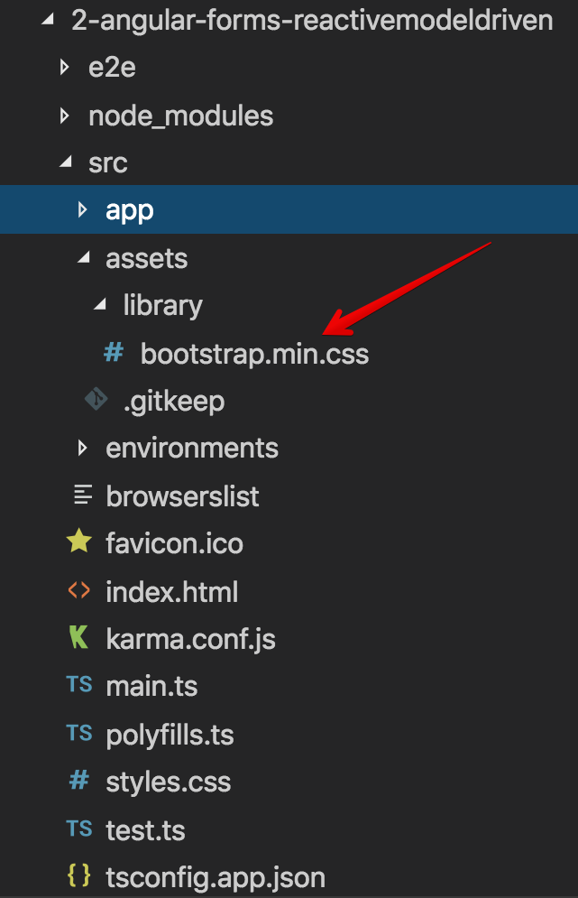
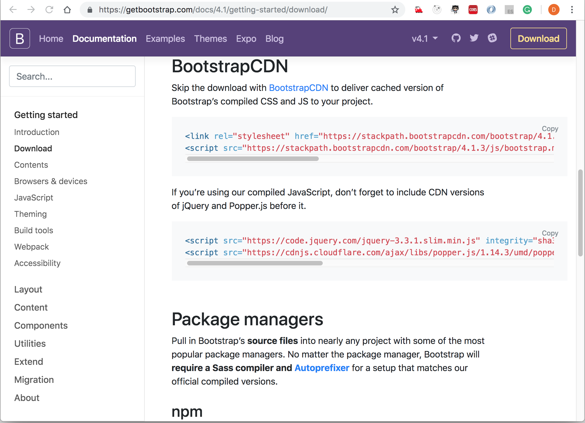
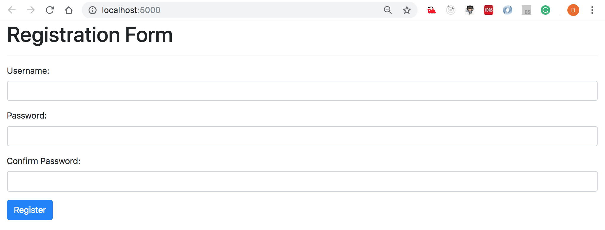
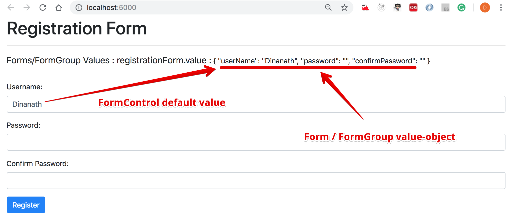
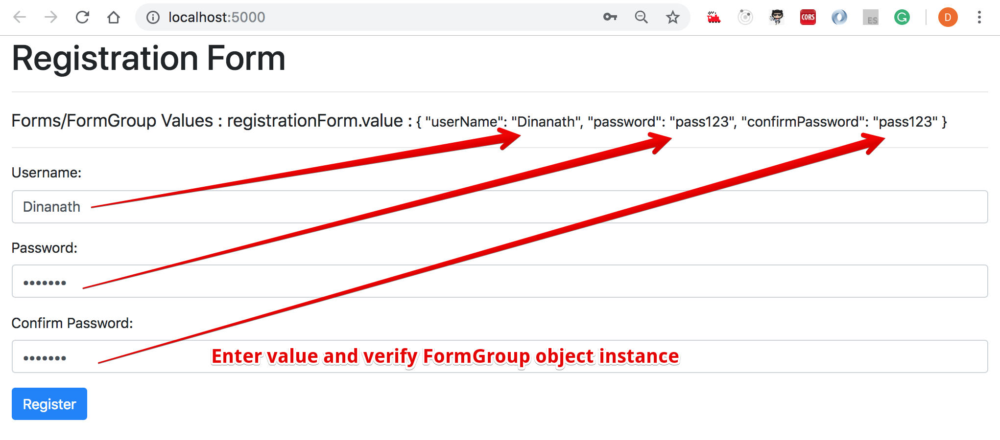
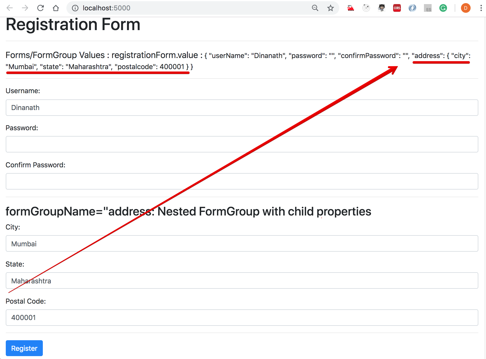
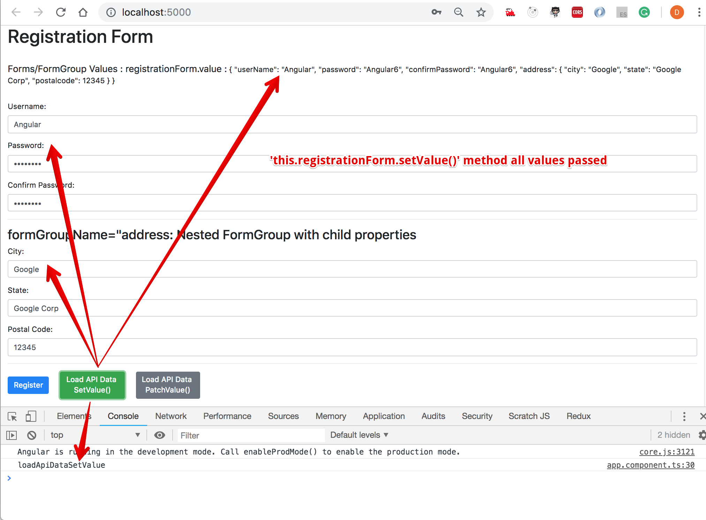
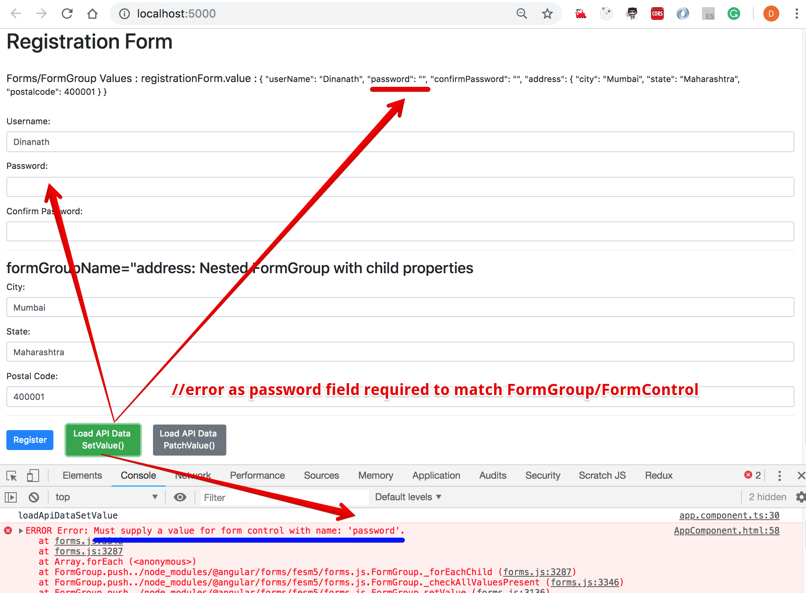
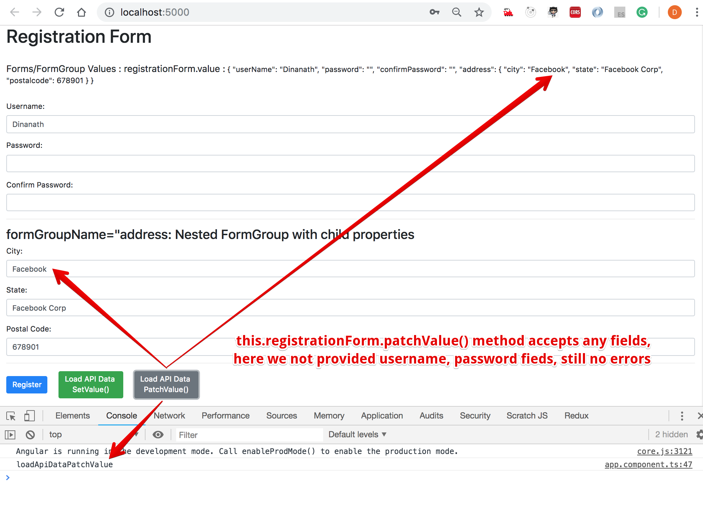
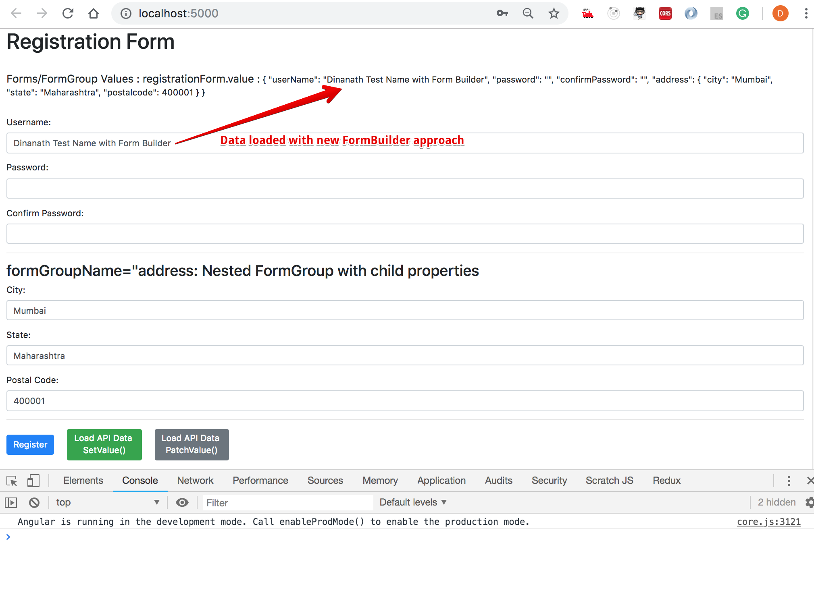

<p align="center">
  
</p>

Angular Reactive Forms (Model driven)
=====================

Working with existing/cloned/copied Angular App
---------------------
- Clone or Download the project/app from Github or any other sources
- If using Visual Studio Code / Insiders, open Command panel/terminal from menu: View -> Terminal (shortcut key is `CTRL + BackTick` OR `COMMAND + J`)
- Go inside the project/app directory, command: `cd _examples-angular-templateDrivenForm OR cd templateDrivenForm`
- Run command: `npm install` to install project/app dependencies `(node_modules)`
- To Build and run Angular App, command: `ng serve / npm start` OR `ng serve -o` OR `ng serve --open`
- To change the port from 4200 to other port - type command:  `ng serve --port 5000`
- To check the application in browser type path/URL: `localhost:4200 / 5000`

1 - Introduction to Reactive Forms (Model-driven)
=====================
1.1 Reactive Model Driven Forms - what is it all about?
---------------------
- Angular reactive forms, also known as model-driven forms, offers an easy way to use reactive programming styles-patterns and validations
- Reactive forms are forms where we write logic, validations, controls in the component's class
- It is flexible and can be used to handle complex form scenarios and large forms
- We write more component code and less HTML code which make unit testing easier

1.2. Some important points about Reactive Forms (Model Driven)
---------------------
- Code and Logic resides in the `component class` (Template Driven Forms focus mainly on HTML template)
- `No Two Way Data Binding`
    - (we need to react to user inputs to update the values, also some inbuilt angular methods are available to update component class)
- Reactive forms are mainly `used/well suited for complex scenarios`:
    - `Dynamic (On the Fly creation)` form fields
        - Initially only one field, click on add button new forms/fields created dynamically (+ Add Product, + Add Friend list, + Add Permanent & temporary address, etc.)
    - `Custom Validation (Crossfield validations)`- Password & Confirm Password validation, old & new password/pin validation etc.
    - `Dynamic validation` - If subscribed to notification than email field is mandatory, hierarchy/dependency based scenarios, If Married enter spouse details, etc.
- `Unit test` - As logic is present in component class (Template Driven Forms we cant unit test HTML templates)

1.3. Steps to work with Reactive Model Driven Forms / Things to do with Reactive Model Driven Forms
---------------------
- Create & use new `Angular CLI` generated project
- Add form HTML template/markup
- Create a form model by using `FormGroup` and `FormControl` classes
- Manage form control data/values
- `FormBuilder` Service (a simpler way to specify/manage form model)
- `Validation implementation` - Simple, Custom, Cross-field, and Dynamic validations
- Add `Dynamic form controls`
- Submit the form data to `server`

2 - Setting up new Angular project
=====================
1. First check `angular cli` installed version details on machine by using command at command prompt: `ng -v` or `ng --version`

<p>
  <figure>
    &nbsp;&nbsp;&nbsp; 
    <figcaption>&nbsp;&nbsp;&nbsp; Image - Angular CLI version</figcaption>
  </figure>
</p>

2. If `angular CLI` not installed/available on machine (no version or error message displayed) then install it by using the command: `npm install -g @angular/cli@latest`
3. To `update/upgrade angular CLI` to the latest version, use following commands in sequence:
    - command: `npm uninstall -g @angular/cli`
    - command: `npm cache verify or npm cache clean`
    - command: `npm install -g @angular/cli@latest`
4. Generate/create a new Angular app/project with Angular CLI - for dealing with angular forms with the syntax: `ng new appName` or `ng new project-name`, command: `ng new angular-forms-reactivemodeldriven` (after creation check the newly generated folder structure)

<p>
  <figure>
    &nbsp;&nbsp;&nbsp; 
    <figcaption>&nbsp;&nbsp;&nbsp; Image - Angular project/app folder structure</figcaption>
  </figure>
</p>

5. To run/serve application, at command prompt type command: `ng serve` or `ng serve --port 5000` or `ng serve --port 5000 -o` (`--port flag` - to change the port number and `-o or --open flag` - to automatically launch/open app in browser)
6. Go to the browser and load the application by typing address: `http://localhost:4200/` or `http://localhost:5000/`
7. Add the `Bootstrap` framework to an application (CSS framework used to make cool/intuitive User Interface and look/feel)
    - Download bootstrap css to local machine from bootstrap website: https://getbootstrap.com/docs/4.1/getting-started/download/ into folder `assets/library/bootstrap.min.css`
    - Include bootstrap in application - index.html under `head` tag - `<link rel="stylesheet" href="./assets/library/bootstrap.min.css" integrity="sha384-MCw98/SFnGE8fJT3GXwEOngsV7Zt27NXFoaoApmYm81iuXoPkFOJwJ8ERdknLPMO" crossorigin="anonymous" />`
    - or you can include a `CDN` path in index.html under head tag
    - or else you can install bootstrap with npm command: `npm install bootstrap` and use it

<p>
  <figure>
    &nbsp;&nbsp;&nbsp; 
    <figcaption>&nbsp;&nbsp;&nbsp; Image - Bootstrap website - installation options</figcaption>
  </figure>
</p>

8. To verify bootstrap included/working properly in an application, check in Browser fonts, etc changed or not?
    - Also in `app.component.html` just create any simple component like buttons or divs with bootstrap class: 
        - `<button class="btn btn-success">Success Button</button>`  or 
        - `<div class="lead">Lead Heading</div>`
        - Right click on element and check in `inspect element` the bootstrap class and properties applied to respective elements

> **Syntax & Example**: index.html
```html
<!doctype html>
<html lang="en">

  <head>
    <meta charset="utf-8">
    <title>ReactiveModelDrivenForms</title>
    <base href="/">

    <meta name="viewport" content="width=device-width, initial-scale=1">
    <link rel="icon" type="image/x-icon" href="favicon.ico">
    <link rel="stylesheet" href="./assets/library/bootstrap.min.css" integrity="sha384-MCw98/SFnGE8fJT3GXwEOngsV7Zt27NXFoaoApmYm81iuXoPkFOJwJ8ERdknLPMO" crossorigin="anonymous" />
  </head>

  <body>

    <app-root></app-root>

  </body>

</html>
```

3 - Adding Form Markup-Template HTML
=====================
3.1. Create an enrollment form with bootstrap classes: 
--------------------- 
- In file `app.component.html` create a registration form
  1. Use bootstrap classes like `form-group` and `form-control` class with div and input field respectively to create form fields with standard look and feel
  2. Create a user-name and email `input fields`
  3. Create a password and confirm `password fields`
  4. Create a submit button named `Register`

> **Syntax & Example**: app.component.html
```html
<div class="container-fluid mb-5">
  <h1>Registration Form</h1>
  <hr />

  <form>

    <!-- user name -->
    <div class="form-group">
      <label for="">Username:</label>
      <input type="text" class="form-control">
    </div>

      <!-- password -->
    <div class="form-group">
      <label for="">Password:</label>
      <input type="password" class="form-control">
    </div>
    
    <!-- confirm password -->
    <div class="form-group">
      <label for="">Confirm Password:</label>
      <input type="password" class="form-control">
    </div>

    <!-- register button -->
    <button class="btn btn-primary" type="submit">Register</button>

  </form>

</div>
```

<p>
  <figure>
    &nbsp;&nbsp;&nbsp; 
    <figcaption>&nbsp;&nbsp;&nbsp; Image - Bootstrap Registration Form</figcaption>
  </figure>
</p>

4 - Creating the Form Model
=====================
To work with reactive/dynamic forms we need to import `'ReactiveFormsModule'` which provides bunch of classes/directives/utilities `(FormGroup & FormControl)` necessary to build reactive/dynamic 

4.1. 3 steps involved in creating reactive form:
---------------------
1. Define HTML `<form>` in component template/view/html file
2. Define component model in component class/.ts file `registrationForm = new FormGroup() `
3. Use directives provided by reactive forms module to associate the model with view `<form [formGroup]="registrationForm">` and  `<input formControlName="userName">,  <input formControlName="password">`

#### Lets follow belows steps to achieve reactive forms 3 main steps:
1. We have already added html form `app.component.html` in last step
2. Now in `app.module.ts`:
    - import { ReactiveFormsModule } from '@angular/forms'; <br/>
    - also add to imports: [ ReactiveFormsModule ]
3. `FormGroup` and `FormControl` are two important building blocks classes for reactive/dynamic forms
    - In Reactive forms, the form is represented by `model in component class`, FormGroup and FormControl classes used to make that model
    - `FormGroup` represents whole/entire form ( `form` is instance of `FormGroup` class ) 
    - `FormControl` represents each form field ( `form fields` are instance of `FormControl` class )
    - `FormBuilder` handle form control creation, dynamic/run time field/FormControl creation
    - `Validators` helps to setup validation on each form control

> **Syntax & Example**: app.module.ts
```typescript
import { BrowserModule } from '@angular/platform-browser';
import { NgModule } from '@angular/core';

import { AppComponent } from './app.component';
import { ReactiveFormsModule } from '@angular/forms';

@NgModule({
  declarations: [
    AppComponent,
  ],
  imports: [
    BrowserModule, 
    ReactiveFormsModule
  ],
  providers: [],
  bootstrap: [AppComponent]
})
export class AppModule { }
```

> **Syntax & Example**: app.component.ts
```typescript
import { Component } from '@angular/core';
import { FormGroup, FormControl } from '@angular/forms';

@Component({
  selector: 'app-root',
  templateUrl: './app.component.html',
  styleUrls: ['./app.component.css']
})

export class AppComponent {

  // create a formgroup instance
  registrationForm = new FormGroup({

    // details of objects/controls present in html
    userName: new FormControl('Dinanath'), // defult value enter in bracket with quotes
    password: new FormControl(''),
    confirmPassword: new FormControl(''),

  });

}
```

> **Syntax & Example**: app.component.html
```html
<div class="container-fluid mb-5">
  <h1>Registration Form</h1>
  <hr />

  {{ registrationForm.value | json }}

  <hr />

  <!-- associate the model with view -->
  <form [formGroup]="registrationForm">

    <!-- user name -->
    <div class="form-group">
        <label for="">Username:</label>
        <input formControlName="userName" type="text" class="form-control">
    </div>

    <!-- password -->
    <div class="form-group">
        <label for="">Password:</label>
        <input formControlName="password" type="password" class="form-control">
    </div>

    <!-- confirm password -->
    <div class="form-group">
        <label for="">Confirm Password:</label>
        <input formControlName="confirmPassword" type="password" class="form-control">
    </div>

    <!-- register button -->
    <button class="btn btn-primary" type="submit">Register</button>

  </form>

</div>
```

<p>
  <figure>
    &nbsp;&nbsp;&nbsp; 
    <figcaption>&nbsp;&nbsp;&nbsp; Image - Form Model, FormControl/FormGroup - defualt values</figcaption>
  </figure>
</p>

<hr/>

<p>
  <figure>
    &nbsp;&nbsp;&nbsp; 
    <figcaption>&nbsp;&nbsp;&nbsp; Image - Form Model, FormControl/FormGroup - updated values</figcaption>
  </figure>
</p>

5 - Nesting/Nested Form Groups 
=====================
- Inside the main form i.e. FormGroup, We can create a other FormGroup and store smaller object properties/FormControl 
    - create `'address'` a new FormGroup with 'street, landmark, road, postal-code' as a child FormControl
    - Under `'user details'` FormGroup create a username, gender, age, etc. as a child FormControl
- In larger/complex forms such approach of creating Nested Form Groups will help to easily manage smaller chunks/sections

> **Syntax & Example**: app.component.ts
```typescript
// create a formgroup instance
registrationForm = new FormGroup({

  // details of objects/controls present in html
  userName: new FormControl('Dinanath'), // defult value enter in bracket with quotes
  password: new FormControl(''),
  confirmPassword: new FormControl(''),

  // sub/nested formgroup
  address: new FormGroup({
      city: new FormControl('Mumbai'),
      state: new FormControl('Maharashtra'),
      postalcode: new FormControl(400001)
  })

});
```

> **Syntax & Example**: app.component.html
```html
<div class="container-fluid mb-5">
  <h1>Registration Form</h1>
  <hr />

  <span class="lead"><strong>Forms/FormGroup Values : registrationForm.value :</strong></span> {{ registrationForm.value | json }} 

  <hr />

  <!-- associate the model with view -->
  <form [formGroup]="registrationForm">

  <!-- user name -->
  <div class="form-group">
      <label for="">Username:</label>
      <input formControlName="userName" type="text" class="form-control">
  </div>

  <!-- password -->
  <div class="form-group">
      <label for="">Password:</label>
      <input formControlName="password" type="password" class="form-control">
  </div>

  <!-- confirm password -->
  <div class="form-group">
      <label for="">Confirm Password:</label>
      <input formControlName="confirmPassword" type="password" class="form-control">
  </div>

  <hr />

  <h3>formGroupName="address: Nested FormGroup with child properties </h3>

  <div formGroupName="address">

    <div class="form-group">
      <label for="">City:</label>
      <input formControlName="city" type="text" class="form-control">
    </div>

    <div class="form-group">
      <label for="">State:</label>
      <input formControlName="state" type="text" class="form-control">
    </div>

    <div class="form-group">
      <label for="">Postal Code:</label>
      <input formControlName="postalcode" type="text" class="form-control">
    </div>

  </div>

  <hr /> 

  <!-- register button -->
  <button class="btn btn-primary" type="submit">Register</button>

  </form>

</div>
```

<p>
  <figure>
    &nbsp;&nbsp;&nbsp; 
    <figcaption>&nbsp;&nbsp;&nbsp; Image - Reactive Form - nested FormGroup</figcaption>
  </figure>
</p>

6 - Managing Control Values with SetValue() & PatchValue()
=====================
- Lets learn how to set FormControl values without any user interaction (set values programatically)
- We can retrieve back-end data by an API/service and set/update the values of FormControl with `'setValue()'` and `'PatchValue()'` method
- **`setValue()`** method works on FormGroup as well as FormControl class, But it accepts exact object structure which matches FormGroup with exact keys as FormControl, no custom deletion or addition of keys/properties allowed (will get an error). setValue is very strict with maintaining the structure of FormGroup - we must provide all FormControl values - we have to fill up/set the value of all the fields
- **`patchValue`** method works on FormGroup as well as FormControl class, it accepts any fields - we can provide/pass value of any required field/few of the fields - we can fill up/set the value of only required fields
- app.component.html: Create a button and kn app.component.ts: define methods:
  - `<button class="btn btn-success ml-4" (click)="loadApiDataSetValue()">Load API Data <br/> SetValue() </button>`
  - `<button class="btn btn-secondary ml-4" (click)="loadApiDataPatchValue()">Load API Data <br> PatchValue() </button>`

> **Syntax & Example**: app.component.ts
```typescript
import { Component } from '@angular/core';
import { FormGroup, FormControl } from '@angular/forms';

@Component({
  selector: 'app-root',
  templateUrl: './app.component.html',
  styleUrls: ['./app.component.css']
})

export class AppComponent {

  // create a formgroup instance
  registrationForm = new FormGroup({

    // details of objects/controls present in html
    userName: new FormControl('Dinanath'), // defult value enter in bracket with quotes
    password: new FormControl(''),
    confirmPassword: new FormControl(''),

    // sub/nested formgroup
    address: new FormGroup({
      city: new FormControl('Mumbai'),
      state: new FormControl('Maharashtra'),
      postalcode: new FormControl(400001)
    })

  });

  loadApiDataSetValue() {
    console.log('loadApiDataSetValue ');
    
    The// setValue method works on FormGroup as well as FormControl class, But it accepts exact object structure which matches FormGroup with exact keys as FormControl, no custom deletion or addition of keys/properties allowed (will get an error). setValue is very strict with maintaining the structure of FormGroup - we must provide all FormControl values - we have to fill up/set the value of all the fields

    this.registrationForm.setValue({
      userName: 'Angular',
      password: 'Angular6', //error - password field required to match FormGroup
      confirmPassword: 'Angular6',

      address: {
        city: 'Google',
        state: 'Google Corp',
        postalcode: 12345,
      }
    })
  }

  loadApiDataPatchValue() {
    console.log('loadApiDataPatchValue ');
    
    // patch value method works on FormGroup as well as FormControl class, it accepts any fields - we can provide/pass the value of any required field/few of the fields - we can fill up/set the value of only required fields

    this.registrationForm.patchValue({
      // userName: 'React',
      // password: 'React2',
      // confirmPassword: 'React2',

      address: {
        city: 'Facebook',
        state: 'Facebook Corp',
        postalcode: 678901,
      }
    })
  }
}
```

> **Syntax & Example**: app.component.html
```html
<div class="container-fluid mb-5">
    <h1>Registration Form</h1>
    <hr />
    
    <span class="lead"><strong>Forms/FormGroup Values : registrationForm.value :</strong></span> {{ registrationForm.value | json }} 

    <hr />
    
    <!-- associate the model with view -->
    <form [formGroup]="registrationForm">

    <!-- user name -->
    <div class="form-group">
        <label for="">Username:</label>
        <input formControlName="userName" type="text" class="form-control">
    </div>

    <!-- password -->
    <div class="form-group">
        <label for="">Password:</label>
        <input formControlName="password" type="password" class="form-control">
    </div>

    <!-- confirm password -->
    <div class="form-group">
        <label for="">Confirm Password:</label>
        <input formControlName="confirmPassword" type="password" class="form-control">
    </div>

    <hr />

    <h3>formGroupName="address: Nested FormGroup with child properties </h3>

    <div formGroupName="address">

      <div class="form-group">
          <label for="">City:</label>
          <input formControlName="city" type="text" class="form-control">
      </div>

      <div class="form-group">
          <label for="">State:</label>
          <input formControlName="state" type="text" class="form-control">
      </div>

      <div class="form-group">
          <label for="">Postal Code:</label>
          <input formControlName="postalcode" type="text" class="form-control">
      </div>

    </div>

    <hr /> 

    <!-- register button -->
    <button class="btn btn-primary" type="submit">Register</button>

    <button class="btn btn-success ml-4" (click)="loadApiDataSetValue()">Load API Data <br/> SetValue()
    </button>

    <button class="btn btn-secondary ml-4" (click)="loadApiDataPatchValue()">Load API Data <br/> PatchValue()
    </button>

  </form>

</div>
```
<p>
  <figure>
    &nbsp;&nbsp;&nbsp; 
    <figcaption>&nbsp;&nbsp;&nbsp; Image - Reactive Form - setValue() method</figcaption>
  </figure>
</p>

<hr />

<p>
  <figure>
    &nbsp;&nbsp;&nbsp; 
    <figcaption>&nbsp;&nbsp;&nbsp; Image - Reactive Form - setValue() method - error</figcaption>
  </figure>
</p>

<hr />

<p>
  <figure>
    &nbsp;&nbsp;&nbsp; 
    <figcaption>&nbsp;&nbsp;&nbsp; Image - Reactive Form - patchValue() method</figcaption>
  </figure>
</p>


7 - FormBuilder Service
=====================
- Creating multiple instances of FormControl classes (name/password/email/address fields) manually is pretty time consuming and repetitive
- `FormBuilder` service provides/consists of methods to handle/generate FormControls dynamically with lesser code
- `FormBuilder` is an alternate simpler service to create FormGroup and FormControls
- Instead of FormGroup and FormControl import FormBuilder service and inject in the constructor
- Comment all old properties related to FormGroup and FormControl and create new with FormBuilder instance 

> **Syntax & Example**: app.component.ts
```typescript
// import { FormGroup, FormControl } from '@angular/forms';
import { FormBuilder } from '@angular/forms';

constructor(private fb: FormBuilder) { }

  /* // create a formgroup instance
  registrationForm = new FormGroup({

    // details of objects/controls present in html
    userName: new FormControl('Dinanath'), // defult value enter in bracket with quotes
    password: new FormControl(''),
    confirmPassword: new FormControl(''),

    // sub/nested formgroup
    address: new FormGroup({
      city: new FormControl('Mumbai'),
      state: new FormControl('Maharashtra'),
      postalcode: new FormControl(400001)
    })

  }); */

  // create a FormBuilder instance
  registrationForm = this.fb.group({
    userName: ['Dinanath Test Name with Form Builder'],
    password: [''],
    confirmPassword: [''],
    address: this.fb.group({
      city: ['Mumbai'],
      state: ['Maharashtra'],
      postalcode: [400001]
    })
  })
```

<p>
  <figure>
    &nbsp;&nbsp;&nbsp; 
    <figcaption>&nbsp;&nbsp;&nbsp; Image - Reactive Form - FormBuilder</figcaption>
  </figure>
</p>
