<p align="center">
  
</p>

Angular Reactive Forms (Model driven)
=====================

Working with existing/cloned/copied Angular App
---------------------
- Clone or Download the project/app from Github or any other sources
- If using Visual Studio Code / Insiders, open Command panel/terminal from menu: View -> Terminal (shortcut key is `CTRL + BackTick` OR `COMMAND + J`)
- Go inside the project/app directory, command: `cd _examples-angular-templateDrivenForm OR cd templateDrivenForm`
- Run command: `npm install` to install project/app dependencies `(node_modules)`
- To Build and run Angular App, command: `ng serve / npm start` OR `ng serve -o` OR `ng serve --open`
- To change the port from 4200 to other port - type command:  `ng serve --port 5000`
- To check the application in browser type path/URL: `localhost:4200 / 5000`

1 - Introduction to Reactive Forms (Model-driven)
=====================
1.1 Reactive Model Driven Forms - what is it all about?
---------------------
- Angular reactive forms, also known as model-driven forms, offers an easy way to use reactive programming styles-patterns and validations
- Reactive forms are forms where we write logic, validations, controls in the component's class
- It is flexible and can be used to handle complex form scenarios and large forms
- We write more component code and less HTML code which make unit testing easier

1.2. Some important points about Reactive Forms (Model Driven)
---------------------
- Code and Logic resides in the `component class` (Template Driven Forms focus mainly on HTML template)
- `No Two Way Data Binding`
    - (we need to react to user inputs to update the values, also some inbuilt angular methods are available to update component class)
- Reactive forms are mainly `used/well suited for complex scenarios`:
    - `Dynamic (On the Fly creation)` form fields
        - Initially only one field, click on add button new forms/fields created dynamically (+ Add Product, + Add Friend list, + Add Permanent & temporary address, etc.)
    - `Custom Validation (Crossfield validations)`- Password & Confirm Password validation, old & new password/pin validation etc.
    - `Dynamic validation` - If subscribed to notification than email field is mandatory, hierarchy/dependency based scenarios, If Married enter spouse details, etc.
- `Unit test` - As logic is present in component class (Template Driven Forms we cant unit test HTML templates)

1.3. Steps to work with Reactive Model Driven Forms / Things to do with Reactive Model Driven Forms
---------------------
- Create & use new `Angular CLI` generated project
- Add form HTML template/markup
- Create a form model by using `FormGroup` and `FormControl` classes
- Manage form control data/values
- `FormBuilder` Service (a simpler way to specify/manage form model)
- `Validation implementation` - Simple, Custom, Cross-field, and Dynamic validations
- Add `Dynamic form controls`
- Submit the form data to `server`

2 - Setting up new Angular project
=====================
1. First check `angular cli` installed version details on machine by using command at command prompt: `ng -v` or `ng --version`

<p>
  <figure>
    &nbsp;&nbsp;&nbsp; 
    <figcaption>&nbsp;&nbsp;&nbsp; Image - Angular CLI version</figcaption>
  </figure>
</p>

2. If `angular CLI` not installed/available on machine (no version or error message displayed) then install it by using the command: `npm install -g @angular/cli@latest`
3. To `update/upgrade angular CLI` to the latest version, use following commands in sequence:
    - command: `npm uninstall -g @angular/cli`
    - command: `npm cache verify or npm cache clean`
    - command: `npm install -g @angular/cli@latest`
4. Generate/create a new Angular app/project with Angular CLI - for dealing with angular forms with the syntax: `ng new appName` or `ng new project-name`, command: `ng new angular-forms-reactivemodeldriven` (after creation check the newly generated folder structure)

<p>
  <figure>
    &nbsp;&nbsp;&nbsp; 
    <figcaption>&nbsp;&nbsp;&nbsp; Image - Angular project/app folder structure</figcaption>
  </figure>
</p>

5. To run/serve application, at command prompt type command: `ng serve` or `ng serve --port 5000` or `ng serve --port 5000 -o` (`--port flag` - to change the port number and `-o or --open flag` - to automatically launch/open app in browser)
6. Go to the browser and load the application by typing address: `http://localhost:4200/` or `http://localhost:5000/`
7. Add the `Bootstrap` framework to an application (CSS framework used to make cool/intuitive User Interface and look/feel)
    - Download bootstrap css to local machine from bootstrap website: https://getbootstrap.com/docs/4.1/getting-started/download/ into folder `assets/library/bootstrap.min.css`
    - Include bootstrap in application - index.html under `head` tag - `<link rel="stylesheet" href="./assets/library/bootstrap.min.css" integrity="sha384-MCw98/SFnGE8fJT3GXwEOngsV7Zt27NXFoaoApmYm81iuXoPkFOJwJ8ERdknLPMO" crossorigin="anonymous" />`
    - or you can include a `CDN` path in index.html under head tag
    - or else you can install bootstrap with npm command: `npm install bootstrap` and use it

<p>
  <figure>
    &nbsp;&nbsp;&nbsp; 
    <figcaption>&nbsp;&nbsp;&nbsp; Image - Bootstrap website - installation options</figcaption>
  </figure>
</p>

8. To verify bootstrap included/working properly in an application, check in Browser fonts, etc changed or not?
    - Also in `app.component.html` just create any simple component like buttons or divs with bootstrap class: 
        - `<button class="btn btn-success">Success Button</button>`  or 
        - `<div class="lead">Lead Heading</div>`
        - Right click on element and check in `inspect element` the bootstrap class and properties applied to respective elements

> **Syntax & Example**: index.html
```html
<!doctype html>
<html lang="en">

  <head>
    <meta charset="utf-8">
    <title>ReactiveModelDrivenForms</title>
    <base href="/">

    <meta name="viewport" content="width=device-width, initial-scale=1">
    <link rel="icon" type="image/x-icon" href="favicon.ico">
    <link rel="stylesheet" href="./assets/library/bootstrap.min.css" integrity="sha384-MCw98/SFnGE8fJT3GXwEOngsV7Zt27NXFoaoApmYm81iuXoPkFOJwJ8ERdknLPMO" crossorigin="anonymous" />
  </head>

  <body>

    <app-root></app-root>

  </body>

</html>
```

3 - Adding Form Markup-Template HTML
=====================
3.1. Create an enrollment form with bootstrap classes: 
--------------------- 
- In file `app.component.html` create a registration form
  1. Use bootstrap classes like `form-group` and `form-control` class with div and input field respectively to create form fields with standard look and feel
  2. Create a user-name and email `input fields`
  3. Create a password and confirm `password fields`
  4. Create a submit button named `Register`

> **Syntax & Example**: app.component.html
```html
<div class="container-fluid mb-5">
  <h1>Registration Form</h1>
  <hr />

  <form>

    <!-- user name -->
    <div class="form-group">
      <label for="">Username:</label>
      <input type="text" class="form-control">
    </div>

      <!-- password -->
    <div class="form-group">
      <label for="">Password:</label>
      <input type="password" class="form-control">
    </div>
    
    <!-- confirm password -->
    <div class="form-group">
      <label for="">Confirm Password:</label>
      <input type="password" class="form-control">
    </div>

    <!-- register button -->
    <button class="btn btn-primary" type="submit">Register</button>

  </form>

</div>
```

<p>
  <figure>
    &nbsp;&nbsp;&nbsp; 
    <figcaption>&nbsp;&nbsp;&nbsp; Image - Bootstrap Registration Form</figcaption>
  </figure>
</p>

4 - Creating the Form Model
=====================
To work with reactive/dynamic forms we need to import `'ReactiveFormsModule'` which provides bunch of classes/directives/utilities `(FormGroup & FormControl)` necessary to build reactive/dynamic 

4.1. 3 steps involved in creating reactive form:
---------------------
1. Define HTML `<form>` in component template/view/html file
2. Define component model in component class/.ts file `registrationForm = new FormGroup() `
3. Use directives provided by reactive forms module to associate the model with view `<form [formGroup]="registrationForm">` and  `<input formControlName="userName">,  <input formControlName="password">`

#### Lets follow belows steps to achieve reactive forms 3 main steps:
1. We have already added html form `app.component.html` in last step
2. Now in `app.module.ts`:
    - import { ReactiveFormsModule } from '@angular/forms'; <br/>
    - also add to imports: [ ReactiveFormsModule ]
3. `FormGroup` and `FormControl` are two important building blocks classes for reactive/dynamic forms
    - In Reactive forms, the form is represented by `model in component class`, FormGroup and FormControl classes used to make that model
    - `FormGroup` represents whole/entire form ( `form` is instance of `FormGroup` class ) 
    - `FormControl` represents each form field ( `form fields` are instance of `FormControl` class )
    - `FormBuilder` handle form control creation, dynamic/run time field/FormControl creation
    - `Validators` helps to setup validation on each form control

> **Syntax & Example**: app.module.ts
```typescript
import { BrowserModule } from '@angular/platform-browser';
import { NgModule } from '@angular/core';

import { AppComponent } from './app.component';
import { ReactiveFormsModule } from '@angular/forms';

@NgModule({
  declarations: [
    AppComponent,
  ],
  imports: [
    BrowserModule, 
    ReactiveFormsModule
  ],
  providers: [],
  bootstrap: [AppComponent]
})
export class AppModule { }
```

> **Syntax & Example**: app.component.ts
```typescript
import { Component } from '@angular/core';
import { FormGroup, FormControl } from '@angular/forms';

@Component({
  selector: 'app-root',
  templateUrl: './app.component.html',
  styleUrls: ['./app.component.css']
})

export class AppComponent {

  // create a formgroup instance
  registrationForm = new FormGroup({

    // details of objects/controls present in html
    userName: new FormControl('Dinanath'), // defult value enter in bracket with quotes
    password: new FormControl(''),
    confirmPassword: new FormControl(''),

  });

}
```

> **Syntax & Example**: app.component.html
```html
<div class="container-fluid mb-5">
  <h1>Registration Form</h1>
  <hr />

  {{ registrationForm.value | json }}

  <hr />

  <!-- associate the model with view -->
  <form [formGroup]="registrationForm">

    <!-- user name -->
    <div class="form-group">
        <label for="">Username:</label>
        <input formControlName="userName" type="text" class="form-control">
    </div>

    <!-- password -->
    <div class="form-group">
        <label for="">Password:</label>
        <input formControlName="password" type="password" class="form-control">
    </div>

    <!-- confirm password -->
    <div class="form-group">
        <label for="">Confirm Password:</label>
        <input formControlName="confirmPassword" type="password" class="form-control">
    </div>

    <!-- register button -->
    <button class="btn btn-primary" type="submit">Register</button>

  </form>

</div>
```

<p>
  <figure>
    &nbsp;&nbsp;&nbsp; 
    <figcaption>&nbsp;&nbsp;&nbsp; Image - Form Model, FormControl/FormGroup - defualt values</figcaption>
  </figure>
</p>

<hr/>

<p>
  <figure>
    &nbsp;&nbsp;&nbsp; 
    <figcaption>&nbsp;&nbsp;&nbsp; Image - Form Model, FormControl/FormGroup - updated values</figcaption>
  </figure>
</p>

5 - Nesting/Nested Form Groups 
=====================
- Inside the main form i.e. FormGroup, We can create a other FormGroup and store smaller object properties/FormControl 
    - create `'address'` a new FormGroup with 'street, landmark, road, postal-code' as a child FormControl
    - Under `'user details'` FormGroup create a username, gender, age, etc. as a child FormControl
- In larger/complex forms such approach of creating Nested Form Groups will help to easily manage smaller chunks/sections

> **Syntax & Example**: app.component.ts
```typescript
// create a formgroup instance
registrationForm = new FormGroup({

  // details of objects/controls present in html
  userName: new FormControl('Dinanath'), // defult value enter in bracket with quotes
  password: new FormControl(''),
  confirmPassword: new FormControl(''),

  // sub/nested formgroup
  address: new FormGroup({
      city: new FormControl('Mumbai'),
      state: new FormControl('Maharashtra'),
      postalcode: new FormControl(400001)
  })

});
```

> **Syntax & Example**: app.component.html
```html
<div class="container-fluid mb-5">
  <h1>Registration Form</h1>
  <hr />

  <span class="lead"><strong>Forms/FormGroup Values : registrationForm.value :</strong></span> {{ registrationForm.value | json }} 

  <hr />

  <!-- associate the model with view -->
  <form [formGroup]="registrationForm">

  <!-- user name -->
  <div class="form-group">
      <label for="">Username:</label>
      <input formControlName="userName" type="text" class="form-control">
  </div>

  <!-- password -->
  <div class="form-group">
      <label for="">Password:</label>
      <input formControlName="password" type="password" class="form-control">
  </div>

  <!-- confirm password -->
  <div class="form-group">
      <label for="">Confirm Password:</label>
      <input formControlName="confirmPassword" type="password" class="form-control">
  </div>

  <hr />

  <h3>formGroupName="address: Nested FormGroup with child properties </h3>

  <div formGroupName="address">

    <div class="form-group">
      <label for="">City:</label>
      <input formControlName="city" type="text" class="form-control">
    </div>

    <div class="form-group">
      <label for="">State:</label>
      <input formControlName="state" type="text" class="form-control">
    </div>

    <div class="form-group">
      <label for="">Postal Code:</label>
      <input formControlName="postalcode" type="text" class="form-control">
    </div>

  </div>

  <hr /> 

  <!-- register button -->
  <button class="btn btn-primary" type="submit">Register</button>

  </form>

</div>
```

<p>
  <figure>
    &nbsp;&nbsp;&nbsp; 
    <figcaption>&nbsp;&nbsp;&nbsp; Image - Reactive Form - nested FormGroup</figcaption>
  </figure>
</p>

6 - Managing Control Values with SetValue() & PatchValue()
=====================
- Lets learn how to set FormControl values without any user interaction (set values programatically)
- We can retrieve back-end data by an API/service and set/update the values of FormControl with `'setValue()'` and `'PatchValue()'` method
- **`setValue()`** method works on FormGroup as well as FormControl class, But it accepts exact object structure which matches FormGroup with exact keys as FormControl, no custom deletion or addition of keys/properties allowed (will get an error). setValue is very strict with maintaining the structure of FormGroup - we must provide all FormControl values - we have to fill up/set the value of all the fields
- **`patchValue`** method works on FormGroup as well as FormControl class, it accepts any fields - we can provide/pass value of any required field/few of the fields - we can fill up/set the value of only required fields
- app.component.html: Create a button and kn app.component.ts: define methods:
  - `<button class="btn btn-success ml-4" (click)="loadApiDataSetValue()">Load API Data <br/> SetValue() </button>`
  - `<button class="btn btn-secondary ml-4" (click)="loadApiDataPatchValue()">Load API Data <br> PatchValue() </button>`

> **Syntax & Example**: app.component.ts
```typescript
import { Component } from '@angular/core';
import { FormGroup, FormControl } from '@angular/forms';

@Component({
  selector: 'app-root',
  templateUrl: './app.component.html',
  styleUrls: ['./app.component.css']
})

export class AppComponent {

  // create a formgroup instance
  registrationForm = new FormGroup({

    // details of objects/controls present in html
    userName: new FormControl('Dinanath'), // defult value enter in bracket with quotes
    password: new FormControl(''),
    confirmPassword: new FormControl(''),

    // sub/nested formgroup
    address: new FormGroup({
      city: new FormControl('Mumbai'),
      state: new FormControl('Maharashtra'),
      postalcode: new FormControl(400001)
    })

  });

  loadApiDataSetValue() {
    console.log('loadApiDataSetValue ');
    
    The// setValue method works on FormGroup as well as FormControl class, But it accepts exact object structure which matches FormGroup with exact keys as FormControl, no custom deletion or addition of keys/properties allowed (will get an error). setValue is very strict with maintaining the structure of FormGroup - we must provide all FormControl values - we have to fill up/set the value of all the fields

    this.registrationForm.setValue({
      userName: 'Angular',
      password: 'Angular6', //error - password field required to match FormGroup
      confirmPassword: 'Angular6',

      address: {
        city: 'Google',
        state: 'Google Corp',
        postalcode: 12345,
      }
    })
  }

  loadApiDataPatchValue() {
    console.log('loadApiDataPatchValue ');
    
    // patch value method works on FormGroup as well as FormControl class, it accepts any fields - we can provide/pass the value of any required field/few of the fields - we can fill up/set the value of only required fields

    this.registrationForm.patchValue({
      // userName: 'React',
      // password: 'React2',
      // confirmPassword: 'React2',

      address: {
        city: 'Facebook',
        state: 'Facebook Corp',
        postalcode: 678901,
      }
    })
  }
}
```

> **Syntax & Example**: app.component.html
```html
<div class="container-fluid mb-5">
    <h1>Registration Form</h1>
    <hr />
    
    <span class="lead"><strong>Forms/FormGroup Values : registrationForm.value :</strong></span> {{ registrationForm.value | json }} 

    <hr />
    
    <!-- associate the model with view -->
    <form [formGroup]="registrationForm">

    <!-- user name -->
    <div class="form-group">
        <label for="">Username:</label>
        <input formControlName="userName" type="text" class="form-control">
    </div>

    <!-- password -->
    <div class="form-group">
        <label for="">Password:</label>
        <input formControlName="password" type="password" class="form-control">
    </div>

    <!-- confirm password -->
    <div class="form-group">
        <label for="">Confirm Password:</label>
        <input formControlName="confirmPassword" type="password" class="form-control">
    </div>

    <hr />

    <h3>formGroupName="address: Nested FormGroup with child properties </h3>

    <div formGroupName="address">

      <div class="form-group">
          <label for="">City:</label>
          <input formControlName="city" type="text" class="form-control">
      </div>

      <div class="form-group">
          <label for="">State:</label>
          <input formControlName="state" type="text" class="form-control">
      </div>

      <div class="form-group">
          <label for="">Postal Code:</label>
          <input formControlName="postalcode" type="text" class="form-control">
      </div>

    </div>

    <hr /> 

    <!-- register button -->
    <button class="btn btn-primary" type="submit">Register</button>

    <button class="btn btn-success ml-4" (click)="loadApiDataSetValue()">Load API Data <br/> SetValue()
    </button>

    <button class="btn btn-secondary ml-4" (click)="loadApiDataPatchValue()">Load API Data <br/> PatchValue()
    </button>

  </form>

</div>
```
<p>
  <figure>
    &nbsp;&nbsp;&nbsp; 
    <figcaption>&nbsp;&nbsp;&nbsp; Image - Reactive Form - setValue() method</figcaption>
  </figure>
</p>

<hr />

<p>
  <figure>
    &nbsp;&nbsp;&nbsp; 
    <figcaption>&nbsp;&nbsp;&nbsp; Image - Reactive Form - setValue() method - error</figcaption>
  </figure>
</p>

<hr />

<p>
  <figure>
    &nbsp;&nbsp;&nbsp; 
    <figcaption>&nbsp;&nbsp;&nbsp; Image - Reactive Form - patchValue() method</figcaption>
  </figure>
</p>


7 - FormBuilder Service
=====================
- Creating multiple instances of FormControl classes (name/password/email/address fields) manually is pretty time consuming and repetitive
- `FormBuilder` service provides/consists of methods to handle/generate FormControls dynamically with lesser code
- `FormBuilder` is an alternate simpler service to create FormGroup and FormControls
- Instead of FormGroup and FormControl import FormBuilder service and inject in the constructor
- Comment all old properties related to FormGroup and FormControl and create new with FormBuilder instance 

> **Syntax & Example**: app.component.ts
```typescript
// import { FormGroup, FormControl } from '@angular/forms';
import { FormBuilder } from '@angular/forms';

constructor(private fb: FormBuilder) { }

  /* // create a formgroup instance
  registrationForm = new FormGroup({

    // details of objects/controls present in html
    userName: new FormControl('Dinanath'), // defult value enter in bracket with quotes
    password: new FormControl(''),
    confirmPassword: new FormControl(''),

    // sub/nested formgroup
    address: new FormGroup({
      city: new FormControl('Mumbai'),
      state: new FormControl('Maharashtra'),
      postalcode: new FormControl(400001)
    })

  }); */

  // create a FormBuilder instance
  registrationForm = this.fb.group({
    userName: ['Dinanath Test Name with Form Builder'],
    password: [''],
    confirmPassword: [''],
    address: this.fb.group({
      city: ['Mumbai'],
      state: ['Maharashtra'],
      postalcode: [400001]
    })
  })
```

<p>
  <figure>
    &nbsp;&nbsp;&nbsp; 
    <figcaption>&nbsp;&nbsp;&nbsp; Image - Reactive Form - FormBuilder</figcaption>
  </figure>
</p>

8 - Implementing simple Validation
=====================
For common use cases (validation purpose) Reactive forms uses set of `validators functions in class file only`, not in html/view/template

8.1 Steps to apply reactive forms validations:
---------------------
1. Apply validation rules to form control - use `validators class`
    - import Validators Class - `import { FormBuilder, Validators } from '@angular/forms';`
    - add validators to form control item -  `userName: ['Dinanath', Validators.required],`
2. Provide a visual feedback for validations
    - use class binding to show red border when form control/field is invalid - `<input [class.is-invalid]="registrationForm.get('userName').invalid && registrationForm.get('userName').touched" formControlName="userName" type="text" class="form-control">`
3. Display a appropriate error message for validation
    - `<small class="text-danger" [class.d-none]="registrationForm.get('userName').valid ||                                                    registrationForm.get('userName').untouched">* Name is required</small>`

> **Syntax & Example**: app.component.ts
```typescript
import { FormBuilder, Validators } from '@angular/forms';

// create a FormBuilder instance
registrationForm = this.fb.group({
  userName: ['Dinanath', Validators.required],
  password: [''],
  confirmPassword: [''],
  address: this.fb.group({
    city: ['Mumbai'],
    state: ['Maharashtra'],
    postalcode: [400001]
  })
})
```

> **Syntax & Example**: app.component.html
```html
<!-- user name -->
<div class="form-group">
  <label for="">Username:</label>
  <!-- class binding to show red border when form control/field is invalid -->
  <input [class.is-invalid]="registrationForm.get('userName').invalid && registrationForm.get('userName').touched" formControlName="userName" type="text" class="form-control">
  <!-- single error with a class binding -->
  <small class="text-danger" [class.d-none]="registrationForm.get('userName').valid ||                                                    registrationForm.get('userName').untouched">* Name is required</small>
</div>
```

8.2 Multiple validation rules:
---------------------
- To apply more than one validation rules, convert Validators to an array - ` userName: ['Dinanath', [Validators.required, Validators.minLength(3)]],`
- With `*ngIf` directive show conditioinal error messages

#### Best practice to access formControl with Getter (keep the code short & simple)
- Create `getter method` to return individual form control and use it in HTML file

> **Syntax & Example**: app.component.ts
```typescript
// getter for userName control/field to keep code short in html file
get userNameControl(){
    return this.registrationForm.get('userName');
}

// create a FormBuilder instance
registrationForm = this.fb.group({
  userName: ['Dinanath', [Validators.required, Validators.minLength(3)]],
  password: [''],
  confirmPassword: [''],
  address: this.fb.group({
      city: ['Mumbai'],
      state: ['Maharashtra'],
      postalcode: [400001]
  })
})
```

> **Syntax & Example**: app.component.html
```html
<!-- user name -->
<div class="form-group">
  <label for="">Username:</label>
  <!-- class binding to show red border when form control/field is invalid -->
  <!-- use getter method for userName control/field to keep code short in html file -->
  <input [class.is-invalid]="userNameControl.invalid && 
                          userNameControl.touched" formControlName="userName" type="text" class="form-control">
  <!-- single error with a class binding -->
  <!-- <small class="text-danger" [class.d-none]="userNameControl.valid ||                                                    userNameControl.untouched">* Name is required</small> -->

  <!-- group or multiple error messages : error property -->
  <div *ngIf="userNameControl.invalid && userNameControl.touched">
      <small class="text-danger" *ngIf="userNameControl.errors?.required">* Name is required</small>
      <small class="text-danger" *ngIf="userNameControl.errors?.minlength">* Name must be 3 characters</small>
  </div>
</div>
```

<p>
  <figure>
    &nbsp;&nbsp;&nbsp; 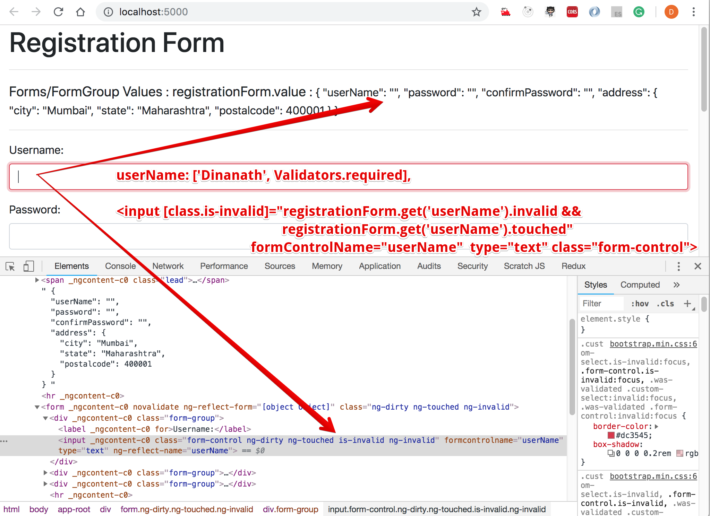
    <figcaption>&nbsp;&nbsp;&nbsp; Image - Reactive Form - Validators.required</figcaption>
  </figure>
</p>

<hr/>

<p>
  <figure>
    &nbsp;&nbsp;&nbsp; 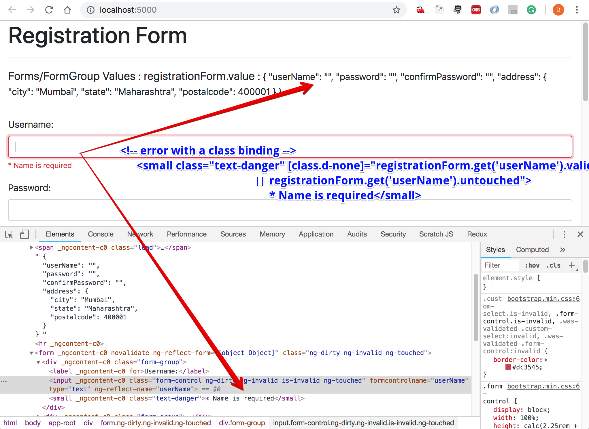
    <figcaption>&nbsp;&nbsp;&nbsp; Image - Reactive Form - Validators.required - show error text</figcaption>
  </figure>
</p>

<hr/>

<p>
  <figure>
    &nbsp;&nbsp;&nbsp; 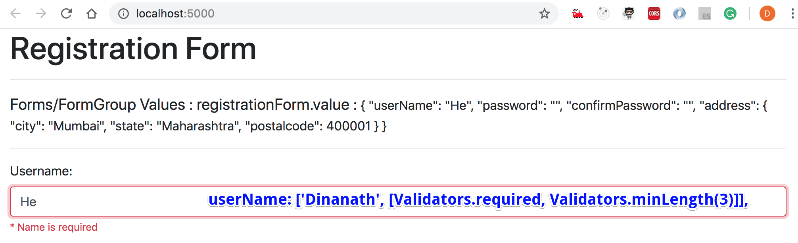
    <figcaption>&nbsp;&nbsp;&nbsp; Image - Reactive Form - Validators.minlength</figcaption>
  </figure>
</p>

<hr/>

<p>
  <figure>
    &nbsp;&nbsp;&nbsp; 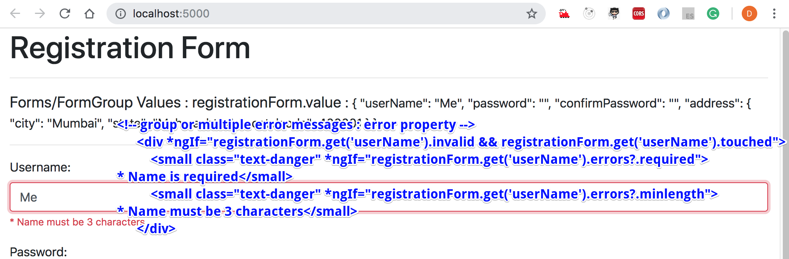
    <figcaption>&nbsp;&nbsp;&nbsp; Image - Reactive Form - Validators.minlength - show error text</figcaption>
  </figure>
</p>

9 - Custom Validation
=====================
- Some times `in-built validators` not match with the exact scenario/requirements
- We can create custom validators for such scenarios like some keywords (spam words) not allowed in user name field, etc.
- Usually custom validators are used through-out the application so its advisable to create custom validators (function class) in an external class file and share
- create folder: `'app/shared/validators'` and inside this folder create a file named: `'user-name.validator.ts'`
  - create a validator function
- Lets use/import newly created custom validator `'user-name.validator.ts'` in `app.component.ts`
  - `import { userNameValidator } from './shared/validators/user-name.validators';` <br/>
    ` userName: ['Dinanath', [Validators.required, Validators.minLength(3), userNameValidator]],`
- Add an error message realted to custom validator in view 
    - ` <small class="text-danger" *ngIf="userNameControl.errors?.validateUserNameError">* '{{userNameControl.errors?.validateUserNameError.value}}' user name not allowed</small>`

> **Syntax & Example**: user-name.validators.ts
```typescript
import { AbstractControl } from "@angular/forms";

// create a validator function to avoid junk/spam names like `admin`
// it returns `string message` or null
export function userNameValidator(control: AbstractControl): { [key: string]: any } | null {
    const isUserNameCorrect = /junk/.test(control.value);
    return isUserNameCorrect ? { 'validateUserName': { value: control.value } } : null;
}
```

> **Syntax & Example**: app.component.ts
```typescript
import { userNameValidator } from './shared/validators/user-name.validators';

// create a FormBuilder instance
registrationForm = this.fb.group({
    userName: ['Dinanath', [Validators.required, Validators.minLength(3), userNameValidator]],
    password: [''],
    confirmPassword: [''],
    address: this.fb.group({
      city: ['Mumbai'],
      state: ['Maharashtra'],
      postalcode: [400001]
    })
})
```

> **Syntax & Example**: app.component.html
```html
<!-- group or multiple error messages : error property -->
<div *ngIf="userNameControl.invalid && userNameControl.touched">
    <small class="text-danger" *ngIf="userNameControl.errors?.required">* Name is required</small>
    <small class="text-danger" *ngIf="userNameControl.errors?.minlength">* Name must be 3 characters</small>
    <small class="text-danger" *ngIf="userNameControl.errors?.validateUserNameError">* '{{userNameControl.errors?.validateUserNameError.value}}' user name not allowed</small>
</div>
```

<p>
  <figure>
    &nbsp;&nbsp;&nbsp; 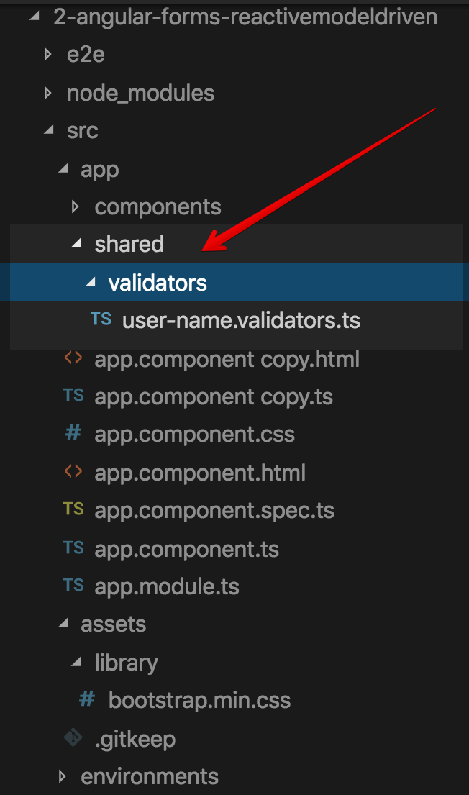
    <figcaption>&nbsp;&nbsp;&nbsp; Image - Reactive Form - custom validators</figcaption>
  </figure>
</p>

<hr/>

<p>
  <figure>
    &nbsp;&nbsp;&nbsp; 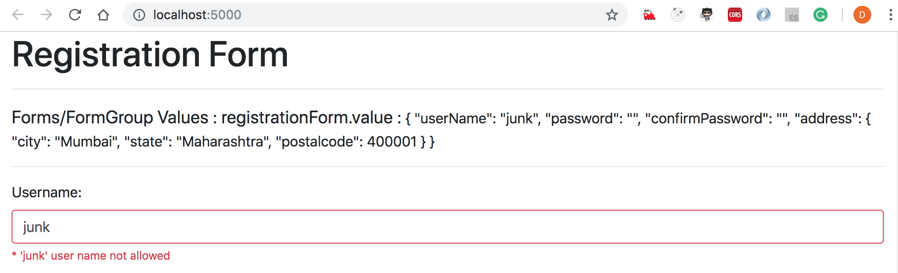
    <figcaption>&nbsp;&nbsp;&nbsp; Image - Reactive Form - custom validators - error text</figcaption>
  </figure>
</p>

10 - Cross Field Validation
=====================
- Sometimes we need to validate values across multiple fields like 'password & confirm password', 'card number', 'verification of pin number' etc.
- Lets create a custom validator to match 'password & confirm password' fields
- In folder: `'app/shared/validators'` create a file named: `'password.validator.ts'`
- Apply custom password validator to formgroup-the main form (not to password formControl)

> **Syntax & Example**: password.validator.ts
```typescript
import { AbstractControl } from "@angular/forms";

// create a validator function to match password and confirm password field
// it returns `boolean` or null
export function passwordValidator(control: AbstractControl): { [key: string]: boolean } | null {
    const passwordControl = control.get('password');
    const confirmPasswordControl = control.get('confirmPassword');

    if (passwordControl.pristine && confirmPasswordControl.pristine || passwordControl.untouched && confirmPasswordControl.untouched) {
      return null;
    }

    return passwordControl && confirmPasswordControl && passwordControl.value != confirmPasswordControl.value ? { 'misMatchError': true } : null;
}
```

> **Syntax & Example**: app.component.ts
```typescript
import { passwordValidator } from './shared/validators/password.validator';

// create a FormBuilder instance
registrationForm = this.fb.group({
    userName: ['Dinanath', [Validators.required, Validators.minLength(3), userNameValidator]],
    password: [''],
    confirmPassword: [''],
    address: this.fb.group({
      city: ['Mumbai'],
      state: ['Maharashtra'],
      postalcode: [400001]
    })
}, {validator: passwordValidator})
```

> **Syntax & Example**: app.component.html
```html
<!-- confirm password -->
<div class="form-group">
    <label for="">Confirm Password:</label>
    
    <!-- class binding to show red border when form control/field is invalid -->
    <input [class.is-invalid]="registrationForm.errors?.passwordMisMatchError" formControlName="confirmPassword" type="password" class="form-control">
    
    <!-- single error with a class binding -->
    <small class="text-danger" *ngIf="registrationForm.errors?.passwordMisMatchError">Confirm Password not matched!</small>
</div>
```

<p>
  <figure>
    &nbsp;&nbsp;&nbsp; 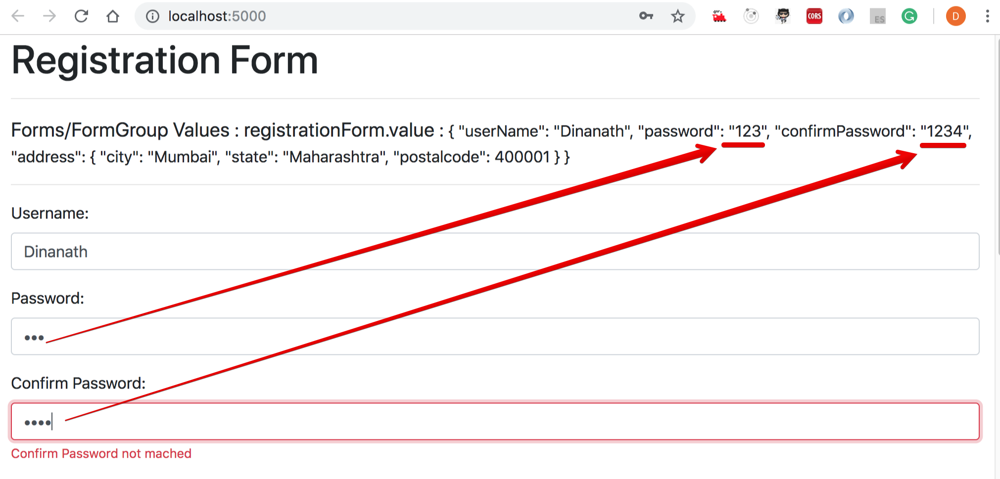
    <figcaption>&nbsp;&nbsp;&nbsp; Image - Reactive Form - custom validators - cross field - error text</figcaption>
  </figure>
</p>

11 - Conditional Dynamic Validation
=====================
- Sometimes we need to apply dynamic validation like after certain action/thing/condition, validations should come in to the picture
- Example: After subscribe checkbox selection -> email field mendatory, 
- Create `email text field` and `subscption checkbox field` in form
- We need to track value of checkbox and conditionaly set status of email field
  - `valueChanges` property helps to track the current value of any controls as a observables
  - `setValidators` methods - set desired validators to formControl/field
  - `clearValidators` methods - clears validators from formControl/field
- Finally we need to invoke/call `updateValueAndValidity` method to reflect latest status

> **Syntax & Example**: app.component.html
```html
<!-- email -->
<div class="form-group">
    <label for="">Email:</label>

    <!-- class binding to show red border when form control/field is invalid -->
    <input [class.is-invalid]="emailControl.invalid && 
    emailControl.touched" formControlName="email" type="text" class="form-control">
    
    <!-- single error with a class binding -->
    <small class="text-danger" [class.d-none]="emailControl.valid || emailControl.untouched">* Email is required</small>
</div>

<!-- subscribe checkbox -->
<div class="form-check mb-3">
    <input formControlName="subscribe" type="checkbox" class="form-check-input">
    <label for="" class="form-check-label">Subscribe/Send me promotion offers</label>
</div>
```

> **Syntax & Example**: app.component.ts
```typescript
import { Component, OnInit } from '@angular/core';
// import { FormGroup, FormControl } from '@angular/forms';
import { FormBuilder, Validators, FormGroup } from '@angular/forms';
import { userNameValidator } from './shared/validators/user-name.validators';
import { passwordValidator } from './shared/validators/password.validator';

@Component({
  selector: 'app-root',
  templateUrl: './app.component.html',
  styleUrls: ['./app.component.css']
})

export class AppComponent implements OnInit {

  registrationForm: FormGroup;

  // getter for userName field to keep code short in html file
  get userNameControl(){
    return this.registrationForm.get('userName');
  }

  // getter for email control/field to keep code short in html file
  get emailControl(){
    return this.registrationForm.get('email');
  }

  constructor(private fb: FormBuilder) { }

  ngOnInit() {
    // create a FormBuilder instance
    this.registrationForm = this.fb.group({
      userName: ['Dinanath', [Validators.required, Validators.minLength(3), userNameValidator]],
      email:[''],
      subscribe:[false],
      password: [''],
      confirmPassword: [''],
      address: this.fb.group({
        city: ['Mumbai'],
        state: ['Maharashtra'],
        postalcode: [400001]
      })
    }, {validator: passwordValidator});

    // subscribe checkbox
    this.registrationForm.get('subscribe').valueChanges
      .subscribe(subscribeCheckedValue => {
        const email =  this.registrationForm.get('email');

        // email field set/unset `required` validators
        if(subscribeCheckedValue){
          email.setValidators(Validators.required);
        } else {
          email.clearValidators();
        }

        // to reflect latest correct status
        email.updateValueAndValidity();

      })
  }

  loadApiDataSetValue() {
    console.log('loadApiDataSetValue ');

    this.registrationForm.setValue({
      userName: 'Angular',
      password: 'Angular6',
      confirmPassword: 'Angular6',

      address: {
        city: 'Google',
        state: 'Google Corp',
        postalcode: 12345,
      }
    })
  }

  loadApiDataPatchValue() {
    console.log('loadApiDataPatchValue ');

    this.registrationForm.patchValue({
      // userName: 'React',
      // password: 'React2',
      // confirmPassword: 'React2',

      address: {
        city: 'Facebook',
        state: 'Facebook Corp',
        postalcode: 678901,
      }
    })
  }

}
```

<p>
  <figure>
    &nbsp;&nbsp;&nbsp; 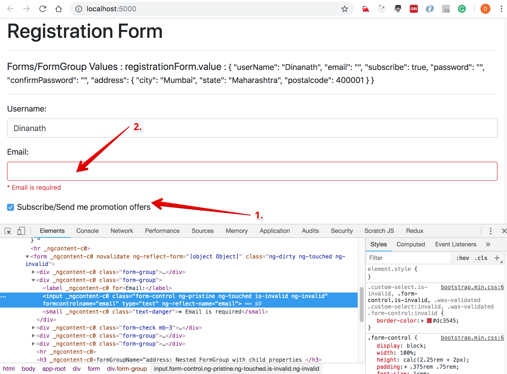
    <figcaption>&nbsp;&nbsp;&nbsp; Image - Reactive Form - custom validators - conditional/hierarchy field - error text</figcaption>
  </figure>
</p>

<hr/>

<p>
  <figure>
    &nbsp;&nbsp;&nbsp; 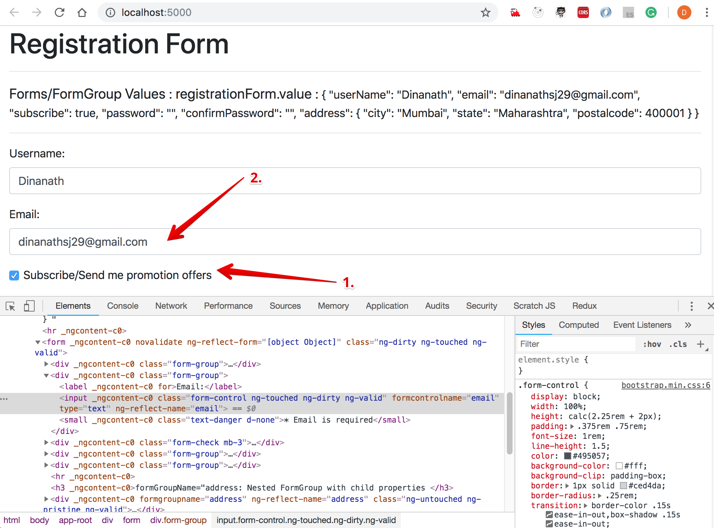
    <figcaption>&nbsp;&nbsp;&nbsp; Image - Reactive Form - custom validators - conditional/hierarchy field - success</figcaption>
  </figure>
</p>


12 - Dynamic Form Controls
======================
- In some scenarios, we need to add fields/records on the fly like click on `Add Patient` button to add new patients record and so on, provide alternate email, contact details, etc.
- The method of adding new fields at run-time keeps form concise and expand only when necessary
- `FormArray` class helps to maintain and duplicate dynamic list of controls
    - import { FormBuilder, Validators, FormGroup, FormArray } from '@angular/forms';
- Define `FormArray` in 'formModel'
    - alternateEmailAddresses:this.fb.array([])
- Create `getter method` to return individual form control and use/access easily it in HTML file
- Create a method to dynamically insert controls to FormArray
- In view create a button `Add alternate Email` to invoke a method to add/push dynamic controls

> **Syntax & Example**: app.component.ts
```typescript
import { Component, OnInit } from '@angular/core';
// import { FormGroup, FormControl } from '@angular/forms';
import { FormBuilder, Validators, FormGroup, FormArray } from '@angular/forms';
import { userNameValidator } from './shared/validators/user-name.validators';
import { passwordValidator } from './shared/validators/password.validator';

@Component({
  selector: 'app-root',
  templateUrl: './app.component.html',
  styleUrls: ['./app.component.css']
})

export class AppComponent implements OnInit {

  registrationForm: FormGroup;

  // getter for userName field to keep code short in html file
  get userNameControl(){
    return this.registrationForm.get('userName');
  }

  // getter for email control/field to keep code short in html file
  get emailControl(){
    return this.registrationForm.get('email');
  }

  // getter for email control/field to keep code short in html file
  get alternateEmailAddressesControl(){
    return this.registrationForm.get('alternateEmailAddresses') as FormArray
  }

  addAlternateEmailAddresses() {
    return this.alternateEmailAddressesControl.push(this.fb.control(''));
  }

  constructor(private fb: FormBuilder) { }

  ngOnInit() {
    // create a FormBuilder instance
    this.registrationForm = this.fb.group({
      userName: ['Dinanath', [Validators.required, Validators.minLength(3), userNameValidator]],
      email:[''],
      subscribe:[false],
      password: [''],
      confirmPassword: [''],
      address: this.fb.group({
        city: ['Mumbai'],
        state: ['Maharashtra'],
        postalcode: [400001]
      }),
      alternateEmailAddresses:this.fb.array([])
    }, {validator: passwordValidator});

    // subscribe checkbox
    this.registrationForm.get('subscribe').valueChanges
      .subscribe(subscribeCheckedValue => {
        const email =  this.registrationForm.get('email');

        // email field set/unset `required` validators
        if(subscribeCheckedValue){
          email.setValidators(Validators.required);
        } else {
          email.clearValidators();
        }

        // to reflect latest correct status
        email.updateValueAndValidity();

      })
  }

  loadApiDataSetValue() {
    console.log('loadApiDataSetValue ');

    this.registrationForm.setValue({
      userName: 'Angular',
      password: 'Angular6',
      confirmPassword: 'Angular6',

      address: {
        city: 'Google',
        state: 'Google Corp',
        postalcode: 12345,
      }
    })
  }

  loadApiDataPatchValue() {
    console.log('loadApiDataPatchValue ');

    this.registrationForm.patchValue({
      // userName: 'React',
      // password: 'React2',
      // confirmPassword: 'React2',

      address: {
        city: 'Facebook',
        state: 'Facebook Corp',
        postalcode: 678901,
      }
    })
  }

}
```

> **Syntax & Example**: app.component.html
```html
<!-- email -->
<div class="form-group">
  <label for="">Email:</label>

  <button type="button "class="btn btn-secondary btn-sm m-2" (click)="addAlternateEmailAddresses(); $event.preventDefault()">Add alternet Email</button>

  <!-- class binding to show red border when form control/field is invalid -->
  <input [class.is-invalid]="emailControl.invalid && 
  emailControl.touched" formControlName="email" type="text" class="form-control">
  
  <!-- single error with a class binding -->
  <small class="text-danger" [class.d-none]="emailControl.valid || emailControl.untouched">* Email is required</small>

  <!-- dynamic emaiil fields to add-->
  <div formArrayName="alternateEmailAddresses" *ngFor="let email of alternateEmailAddressesControl.controls; let i=index">
  <input type="text" class="form-control my-2" [formControlName]="i">
  </div>

</div>
```

<p>
  <figure>
    &nbsp;&nbsp;&nbsp; 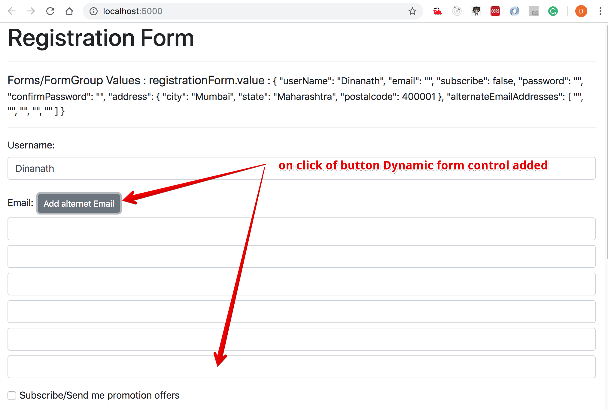
    <figcaption>&nbsp;&nbsp;&nbsp; Image - Reactive Form - add dynamic email field/control</figcaption>
  </figure>
</p>


13 - Submitting Form Data
======================
1. Use `'novalidate'` attribute to form tag to avoid/prevent browser `default validations` when will click on 'SUBMIT' button.
2. Bind `'ngSubmit'` event to the form tag which will trigger on 'SUBMIT' button
    - ```<form [formGroup]="registrationForm" (ngSubmit)="onSubmit()">```
3. Define `onSubmit()` event handler in `app.component.ts` class file

> **Syntax & Example**: app.component.html
```html
<form [formGroup]="registrationForm" novalidate (ngSubmit)="onSubmit()">
```

> **Syntax & Example**: app.component.ts
```typescript
// handler for submit button
onSubmit() {
  console.log('submit button clicked');
  console.log(this.registrationForm.value);
}
```

4. To send data to the server we need to create/use `'registration service'` with angular CLI by using the command: `ng generate service registration` or `ng g s registration`  
    - `registration.service.ts:`
      - Import HttpClient module: import { HttpClient } from '@angular/common/http';
      - Invoke HttpClient in constructor as a local variable / Dependency injection:  <br/>
      constructor(public _httpClient:HttpClient) { }
5. `app.module.ts: `
    - import HttpClientModule: import { HttpClientModule } from '@angular/common/http'; 
    - add to the imports array: <br/>
    imports: [
      BrowserModule, 
      FormsModule,
      HttpClientModule
    ],
6. `registration.service.ts:` 
    - // create a variable which hold path to which will post the date <br/>
     _url = 'http://localhost:3000/enroll';
    - // create a method called register which will post the data to server
    register(userData) {
        return this._httpClient.post`<any>`(this._url, userData);
    }
7. `app.component.ts: `
    - The Post request will return response as an `observable`, so we need to subscribe to observables in app.component.ts
    - Import registration service: import { RegistrationService } from './registration.service';
    - Invoke in constructor as a local variable / Dependency injection: <br/> 
    constructor(public registrationService:RegistrationService) { }
    - On submit button clicked i.e. in onSubmit() method subscribe to the observables: <br/> 
    // handler for submit button
    onSubmit() {
      console.log('submit button clicked');
      console.log(this.registrationForm.value);

      this.registrationService.register(this.registrationForm.value)
      .subscribe(
        response => console.log('Success', response),
        error => console.log('Error', error)
      )
    }

> **Syntax & Example**: app.module.ts
```typescript
import { BrowserModule } from '@angular/platform-browser';
import { NgModule } from '@angular/core';
import { HttpClientModule } from '@angular/common/http'; 

import { AppComponent } from './app.component';
import { ReactiveFormsModule } from '@angular/forms';
import { FormBuilderComponent } from './components/form-builder/form-builder.component';

@NgModule({
  declarations: [
    AppComponent,
    FormBuilderComponent
  ],
  imports: [
    BrowserModule, 
    ReactiveFormsModule,
    HttpClientModule
  ],
  providers: [],
  bootstrap: [AppComponent]
})
export class AppModule { }

```

> **Syntax & Example**: registration.service.ts
```typescript
import { Injectable } from '@angular/core';
import { HttpClient, HttpErrorResponse } from '@angular/common/http';

// to catch error
import { catchError } from 'rxjs/operators';
import { throwError } from 'rxjs';

@Injectable({
  providedIn: 'root'
})
export class RegistrationService {
  // create a variable which holds the path to which will post the date
  _url = 'http://localhost:3000/enroll';

  constructor(public _httpClient: HttpClient ) { }

  // create a method called enroll which will post the data to server
  register(userData) {
  return this._httpClient.post<any>(this._url, userData)
    .pipe(catchError(this.errorHandler)) //catch errors
  }

  errorHandler(error: HttpErrorResponse) {
    return throwError(error);
  }
}
```

> **Syntax & Example**: app.component.ts
```typescript
import { Component, OnInit } from '@angular/core';
// import { FormGroup, FormControl } from '@angular/forms';
import { FormBuilder, Validators, FormGroup, FormArray } from '@angular/forms';
import { userNameValidator } from './shared/validators/user-name.validators';
import { passwordValidator } from './shared/validators/password.validator';
import { RegistrationService } from './registration.service';

@Component({
  selector: 'app-root',
  templateUrl: './app.component.html',
  styleUrls: ['./app.component.css']
})

export class AppComponent implements OnInit {

  registrationForm: FormGroup;

  // getter for userName field to keep code short in html file
  get userNameControl() {
    return this.registrationForm.get('userName');
  }

  // getter for email control/field to keep code short in html file
  get emailControl() {
    return this.registrationForm.get('email');
  }

  // getter for email control/field to keep code short in html file
  get alternateEmailAddressesControl() {
    return this.registrationForm.get('alternateEmailAddresses') as FormArray
  }

  addAlternateEmailAddresses() {
    return this.alternateEmailAddressesControl.push(this.fb.control(''));
  }

  // create a new data member/property to bind to the view
  errorMessage = '';

  // to check form submitted or not
  isFormSubmitted = false;

  constructor(private fb: FormBuilder, public registrationService: RegistrationService) { }

  ngOnInit() {
  // create a FormBuilder instance
  this.registrationForm = this.fb.group({
    userName: ['Dinanath', [Validators.required, Validators.minLength(3), userNameValidator]],
    email: [''],
    subscribe: [false],
    password: [''],
    confirmPassword: [''],
    address: this.fb.group({
    city: ['Mumbai'],
    state: ['Maharashtra'],
    postalcode: [400001]
    }),
    alternateEmailAddresses: this.fb.array([])
  }, { validator: passwordValidator });

  // subscribe checkbox
  this.registrationForm.get('subscribe').valueChanges
    .subscribe(subscribeCheckedValue => {
      const email = this.registrationForm.get('email');

      // email field set/unset `required` validators
      if (subscribeCheckedValue) {
        email.setValidators(Validators.required);
      } else {
        email.clearValidators();
      }

      // to reflect latest correct status
      email.updateValueAndValidity();

    })
  }

  loadApiDataSetValue() {
  console.log('loadApiDataSetValue ');

    this.registrationForm.setValue({
      userName: 'Angular',
      password: 'Angular6',
      confirmPassword: 'Angular6',

      address: {
      city: 'Google',
      state: 'Google Corp',
      postalcode: 12345,
      }
    })
  }

  loadApiDataPatchValue() {
    console.log('loadApiDataPatchValue ');

    this.registrationForm.patchValue({
      // userName: 'React',
      // password: 'React2',
      // confirmPassword: 'React2',

      address: {
        city: 'Facebook',
        state: 'Facebook Corp',
        postalcode: 678901,
      }
    })
  }

  // handler for submit button
  onSubmit() {
    console.log('submit button clicked');
    console.log(this.registrationForm.value);
    this. isFormSubmitted = true;
    this.registrationService.register(this.registrationForm.value)
    .subscribe(
      response => console.log('Success', response),
      // error => console.log('Error', error)

      // store error in data member / property to bind to the view
      error => this.errorMessage = error.statusText
    )
  }
}
```

<p>
  <figure>
    &nbsp;&nbsp;&nbsp; 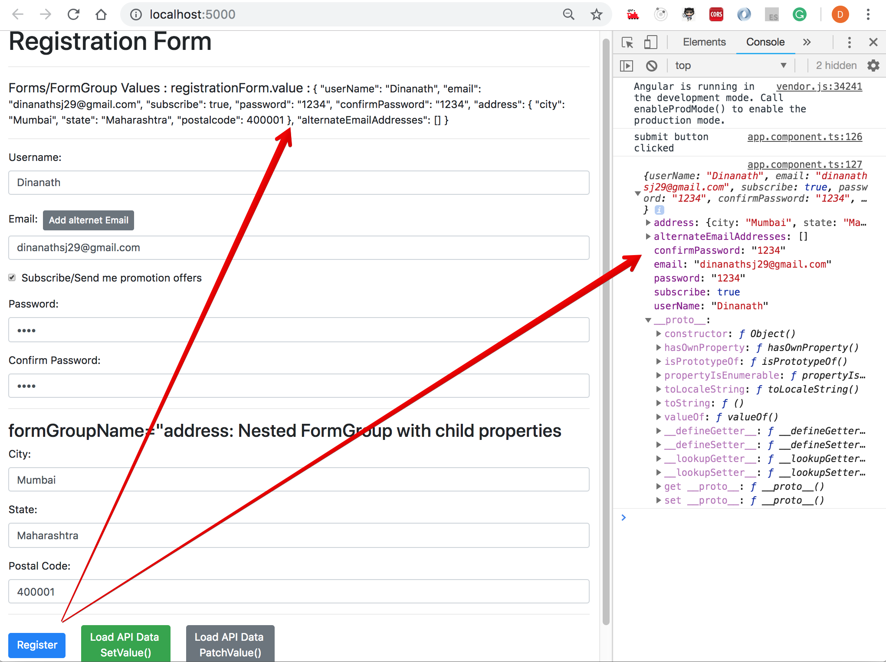
    <figcaption>&nbsp;&nbsp;&nbsp; Image - Reactive Form - Submit Form data</figcaption>
  </figure>
</p>

14 - Express Server to Receive Form Data
=====================
1. At the root, besides the angular application folder create a new siblings folder named `'server'` which consists of server-side code
2. Run the command: `npm init --yes` to create a `package.json` also bypass-surpass the questions with default answers (without giving answers to questions)
3. Install express and other dependencies with the command: <br/>
    `npm install --save express body-parser cors` <br/>
```
"dependencies": {
    "body-parser": "^1.18.3", - middleware to handle form data
    "cors": "^2.8.4", - helps to make request through multiple ports/servers - cross origin resource sharing
    "express": "^4.16.3" - web server
}
```

4. Inside a `server` folder create a new file named `'server.js'`
5. at command prompt/terminal run command: `node server` - will get output in terminal as 'Server running on localhost port:  3000'
6. in browser type path: `'http://localhost:3000/'` - output - 'Hello from the server!'
7. add an endpoint in server.js to which angular application will post data
// add endpoint
app.post('/enroll', function(req,res){
    // req.body - contains user data send by the angular
    console.log(req.body);
    // send response
    res.status(200).send({'message': 'Data received'});
})
8. insert/add endpoint path to angular url variable in 'enrollment.service.ts'
    _url = 'http://localhost:3000/enroll';
9. restart the node server by command: `node server`
10. In angular application click on the submit button and check `inspect element` console as well as node console will get the message and user data as an output. for better usability its advisable to hide actual form/hide submit button / disable submit button etc. to avoid the extra click on submit button.

> **Syntax & Example**: server.ts
```typescript
// 1. imports/requires the packages
const express = require('express');
const bodyParser = require('body-parser');
const cors = require('cors');

// port
const PORT = 3000;

const app = express();

// handle the json data
app.use(bodyParser.json());

app.use(cors());

// test/check get request
app.get('/',function(req, res){
    res.send('Hello from server!');
})

// add endpoint
app.post('/enroll', function(req,res){
    // req.body - contains user data send by the angular
    console.log(req.body);
    // send response
    res.status(200).send({'message': 'Data received'});

    // to see errors 
    // res.status(401).send({'message': 'Data received'});
})

// listen to request
app.listen(PORT, function(){
    console.log('Server running on localhost port: ', PORT);
})
```

<p>
  <figure>
    &nbsp;&nbsp;&nbsp; 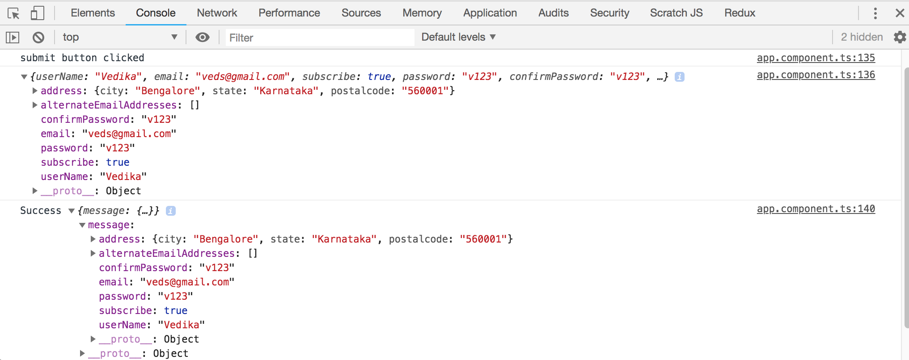
    <figcaption>&nbsp;&nbsp;&nbsp; Image - Reactive Form - Submit Form data with Node Server</figcaption>
  </figure>
</p>

<hr/>

<p>
  <figure>
    &nbsp;&nbsp;&nbsp; 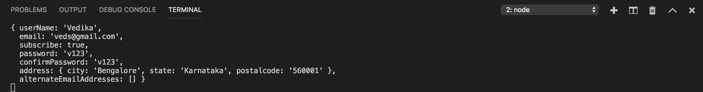
    <figcaption>&nbsp;&nbsp;&nbsp; Image - Reactive Form - Submit Form data with Node Server Response</figcaption>
  </figure>
</p>
